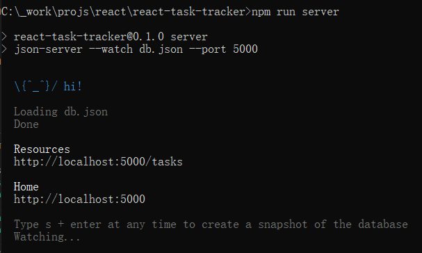
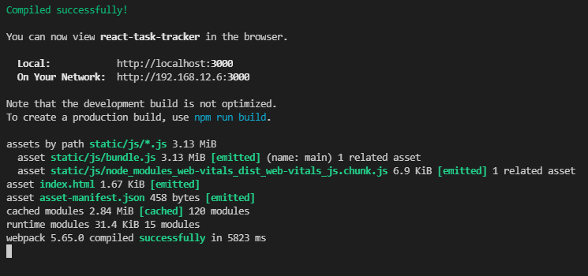
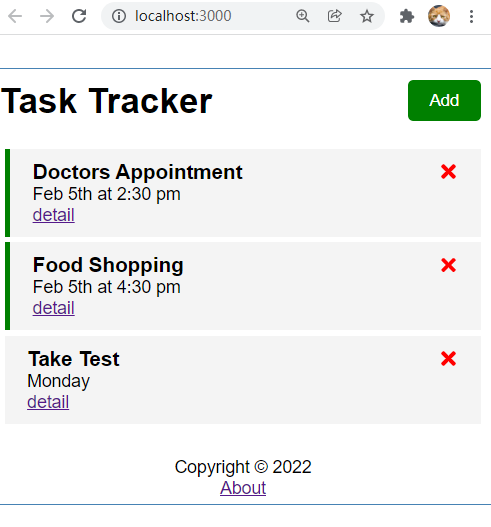

# React-Task-Tracker

## Following below tutorials , I created this project.
[React JS Crash Course](https://www.youtube.com/watch?v=w7ejDZ8SWv8)

[React Router v6 Major Changes](https://www.youtube.com/watch?v=k2Zk5cbiZhg)

## Prerequisites
[nodejs](https://nodejs.org) , Tested with Version 8.1.2

Install all needed modules
```
npm install
```

China Mainland users can use this setting before installing modules to accelerate download:
> `npm config set registry http://registry.npm.taobao.org`

## Run App
`npm run server` to start json-server at port 5000


`npm start` to start web app



